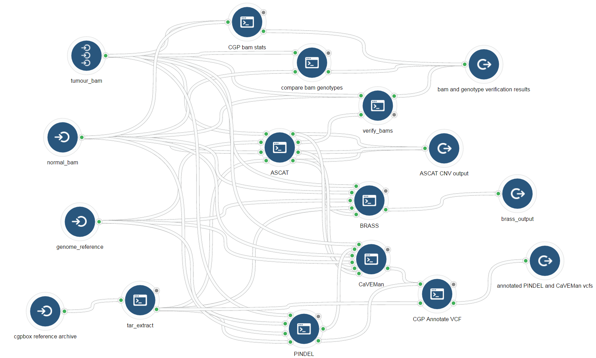

---
title: 'CGPBox Pipeline'
author: '---'
output:
  html_document:
    toc: true
    toc_float:
      collapsed: true
      smooth_scroll: false
---  

```{r include = FALSE}
require(rmarkdown); require(knitr);

options(max.print = "99", knitr.duplicate.label = 'allow'); opts_knit$set(width = 99)
opts_chunk$set(cache=FALSE, tidy=FALSE)

```

# Workflow Graph

https://github.com/cancerit/cgpbox

This is a repackaging of the cgpbox pipeline to allow for parellization via the rabix executor and descriptions of the tools included by commmon workflow language.

<p></p>

<br><br>

# Descriptions of Individual Tools

## 1. CGP Bam Stats {.tabset .tabset-fade .tabset-tabs}

```{r child = '~/cgpbox-cwl/Rmarkdown/bam_stats.Rmd'}


```

## 2. CGP Genotype Check {.tabset .tabset-fade .tabset-tabs}

```{r child = '~/cgpbox-cwl/Rmarkdown/genotype_check.Rmd'}


```

## 3. Verify Bams {.tabset .tabset-fade .tabset-tabs}

```{r child = '~/cgpbox-cwl/Rmarkdown/verify_bams.Rmd'}


```

## 4. ASCAT {.tabset .tabset-fade .tabset-tabs}

```{r child = '~/cgpbox-cwl/Rmarkdown/ascat.Rmd'}


```

## 5. CGP Pindel {.tabset .tabset-fade .tabset-tabs}

```{r child = '~/cgpbox-cwl/Rmarkdown/pindel.Rmd'}


```

## 6. CaVEMan {.tabset .tabset-fade .tabset-tabs}

```{r child = '~/cgpbox-cwl/Rmarkdown/caveman.Rmd'}


```

## 7. Brass {.tabset .tabset-fade .tabset-tabs}

```{r child = '~/cgpbox-cwl/Rmarkdown/brass.Rmd'}


```

## 8. CGP Annotate VCF {.tabset .tabset-fade .tabset-tabs}

```{r child = '~/cgpbox-cwl/Rmarkdown/cgp_annotate_vcf.Rmd'}


```

# CGC Batch Task Launcher

<iframe src="https://teamcgc.shinyapps.io/cgc_cgpbox_launcher/" style="border: none; width: 900px; height: 600px"></iframe>

